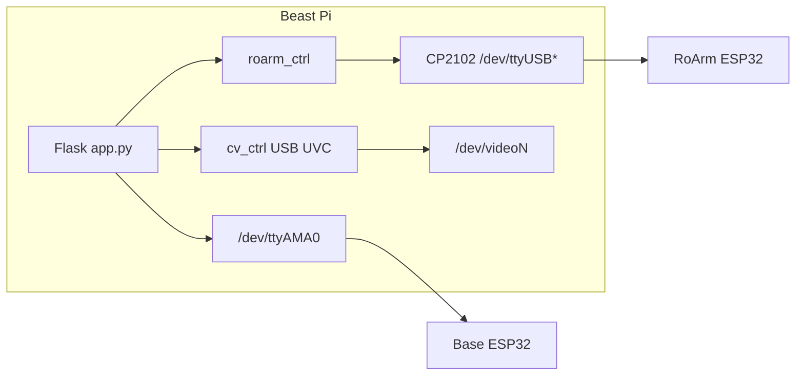
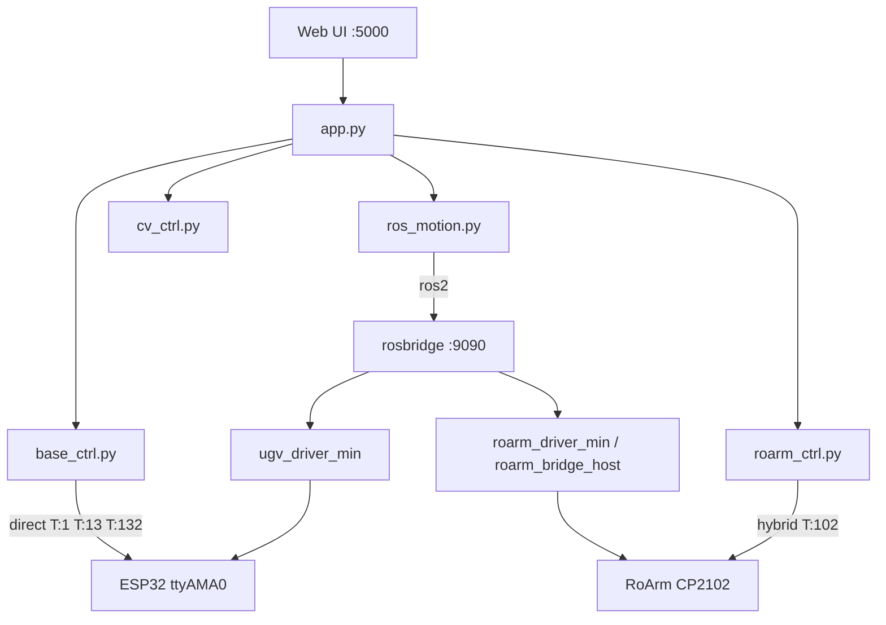
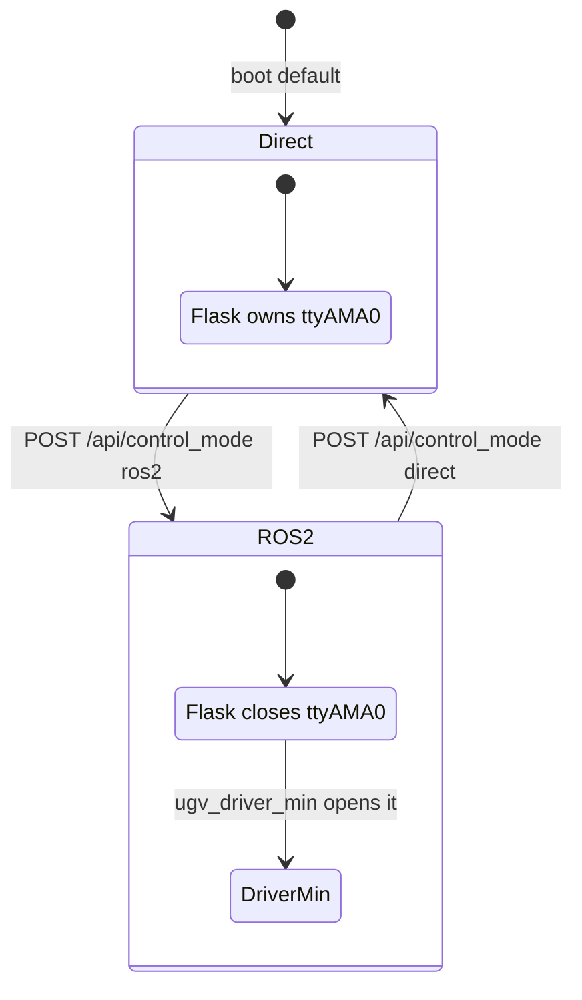
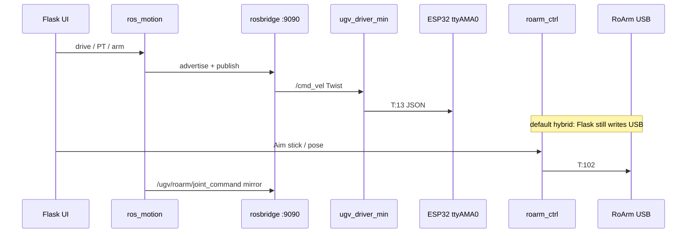
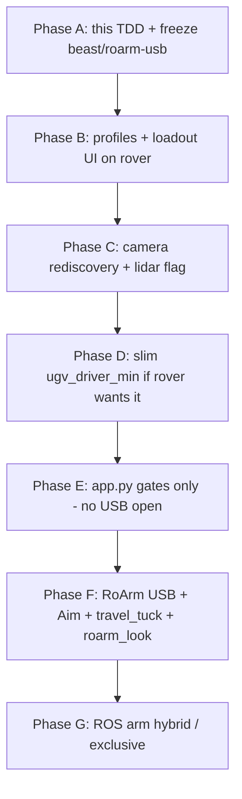

# Beast Branch Technical Design

**Document type:** technical detailed design (TDD)  
**Code line:** `beast/roarm-usb` @ `29250fa` (beast `main`, clean tree)  
**Machine:** UGV Beast, `ws@10.0.0.27`, hostname `beast`  
**Split from rover:** `0a1258b` (`fix(seek): treat bright blank walls as blocked; correct drive linear sign`)  
**Audience:** anyone porting this tree onto rover as a hybrid (profiles + loadout UI, RoArm last)  
**Related short docs:** [CONFIG_PROFILES.md](CONFIG_PROFILES.md), [ROARM.md](ROARM.md), [MERGE_PTZ_AND_ROARM_PLAN.md](MERGE_PTZ_AND_ROARM_PLAN.md)  
**Local-only (not in this git tree):** `$HOME/beast-image/` (`CUSTOM_BUILD.md`, `ROARM_CONTROL_PLAN.md`, proof logs)

This document is the design authority for what beast built after the split. The three older markdown files stay as operator notes and an earlier merge checklist. They do not replace this TDD.

---

## Table of contents

1. [Purpose and non-goals](#1-purpose-and-non-goals)
2. [Hardware inventory](#2-hardware-inventory)
3. [Software topology](#3-software-topology)
4. [Product rules](#4-product-rules)
5. [Configuration model](#5-configuration-model)
6. [Control planes](#6-control-planes)
7. [USB RoArm](#7-usb-roarm)
8. [Camera rediscovery](#8-camera-rediscovery)
9. [Seek and look-around on Beast](#9-seek-and-look-around-on-beast)
10. [UI surfaces](#10-ui-surfaces)
11. [ROS 2 stack](#11-ros-2-stack)
12. [Serial and JSON contracts](#12-serial-and-json-contracts)
13. [Module and file map](#13-module-and-file-map)
14. [HTTP API additions](#14-http-api-additions)
15. [Tests](#15-tests)
16. [Safety and invariants](#16-safety-and-invariants)
17. [Known gaps](#17-known-gaps)
18. [Transfer plan onto rover](#18-transfer-plan-onto-rover)
19. [Appendix A — environment variables](#19-appendix-a--environment-variables)
20. [Appendix B — ROS topics](#20-appendix-b--ros-topics)
21. [Appendix C — commit list since the split](#21-appendix-c--commit-list-since-the-split)

---

## 1. Purpose and non-goals

### Purpose

Beast is a tracked UGV with a **USB RoArm-M2-S** and a **USB UVC camera**. After `0a1258b` the rover tree kept going (Seek honesty, Track, STOP, rosbridge autoheal). Beast kept going on a different path (USB arm, Aim, travel_tuck, camera rediscovery, slim ROS drivers).

This TDD records:

- what beast actually is (hardware + software)
- which features are beast-only vs shared with rover
- the contracts (UART, USB, ROS, HTTP, config) a hybrid must preserve
- a phased transfer order onto rover that does **not** merge `config.yaml` and leaves RoArm last

### Non-goals

- Not a merge of the two working trees. Rover stays the integration base.
- Not a kernel / SD reflash plan. Beast stays on 6.6.31 until that work is backed up.
- Not Hailo. Hailo is rover-only. Beast has no M.2 hat.
- Not enabling lidar by default. `/dev/ttyACM0` exists; `use_lidar: false`.
- Not publishing secrets. `.env` is gitignored. Do not commit keys or camera dumps.

---

## 2. Hardware inventory

| Item | Beast (`10.0.0.27`) | Rover (`10.0.0.26`) | Hybrid implication |
|------|---------------------|---------------------|--------------------|
| SBC | Pi 5, Debian 12, kernel **6.6.31** | Pi 5, Debian 12, kernel **6.12.25** | App merge does not need kernel parity |
| Chassis | UGV Beast, **tracks**, `main_type: 3` | UGV Rover, **wheels**, `main_type: 2` | Profile / loadout, not a code fork |
| Drive sign | `drive_linear_sign: +1` | `drive_linear_sign: -1` | Per-machine. Never copy `config.yaml` |
| Attachment | RoArm-M2-S, `module_type: 1` | PTZ gimbal, `module_type: 2` | Loadout picker later |
| Arm link | USB-C **CP2102** @ 115200 | none | Independent of chassis UART |
| Base MCU | ESP32 on **`/dev/ttyAMA0`** @ 115200 | same | One owner at a time (Flask or ROS) |
| Camera | USB UVC (index can jump) | CSI / Picamera2 | Rediscovery is USB-only |
| Lidar | QinHeng `1a86:55d3` as `/dev/ttyACM0`, **disabled** | configured separately | Flag only |
| Hailo | **not fitted** | M.2 hat + `pciex1` | Rover-only |
| GitHub push | none on this Pi | `gh` works | Push beast branches via rover |



Two serial worlds. Mixing them is the usual failure mode.

---

## 3. Software topology



Default beast runtime:

- Flask owns the **arm USB** (hybrid).
- Chassis is either Direct (Flask owns `ttyAMA0`) or ROS 2 (`ugv_driver_min` owns `ttyAMA0`).
- Camera is USB UVC with rediscovery.
- Seek / Chat / Raw shell is the shared fork UI from before the split.

---

## 4. Product rules

These are the non-negotiables from the dual-robot work. A hybrid must keep them.

1. **PTZ robot** (`module_type: 2`, transport not `usb_serial`): full Seek + PTZ. No CP2102 open. No `travel_tuck`. No Aim:RoArm unless forced.
2. **Beast** (`module_type: 1`, `arm_config.transport: usb_serial`): chassis + shared UI from the fork. Arm is USB. Default pose is **`travel_tuck`**. Look-around is **not** a PTZ sweep.
3. **Chassis `control_mode`** (direct vs ros2) is one implementation. Arm USB is independent of who owns `ttyAMA0`.
4. **`config.yaml` is per machine.** Do not merge it. Do not copy rover signs onto beast or the reverse.
5. **Do not call firmware `T:100` as a safe stow** near furniture. That is the inverted-L home, long reach.

---

## 5. Configuration model

### 5.1 Live beast `config.yaml` (authoritative on this Pi)

| Key | Beast value | Meaning |
|-----|-------------|---------|
| `base_config.main_type` | `3` | UGV Beast (tracks) |
| `base_config.module_type` | `1` | RoArm-M2-S UI layout |
| `base_config.robot_name` | `UGV Beast` | HUD / OLED |
| `base_config.use_lidar` | `false` | Hardware present, software off |
| `base_config.drive_linear_sign` | `+1` | Body +X = camera-forward |
| `base_config.drive_angular_sign` | `+1` | +Z = CCW |
| `arm_config.transport` | `usb_serial` | CP2102, not base UART |
| `arm_config.serial_port` | `""` | Auto: `ROARM_SERIAL` or by-id |
| `arm_config.baud` | `115200` | |
| `arm_config.ui_aim_default` | `roarm` | Overlay stick → arm |
| `arm_config.default_pose` | `travel_tuck` | Boot / stow |
| `cmd_config.cmd_arm_ctrl_ui` | `144` | Stock E/Z/R stick (mapped to joints) |

Rover contrast (do not copy onto beast): `main_type: 2`, gimbal `module_type: 2`, `drive_linear_sign: -1`, no `arm_config.transport: usb_serial`.

### 5.2 Transport resolver

`app.py` treats these as USB RoArm: `usb`, `usb_serial`, `roarm_usb`, `cp2102`. Anything else is `base_uart` (stock T:144 on the chassis ESP32).

### 5.3 Runtime files (gitignored)

| File | Role |
|------|------|
| `.env` | Motion backend, rosbridge, OpenAI-compatible keys |
| `.ui_aim_mode.json` | Last Aim: RoArm vs PT |
| `.loadout.json` | Planned on rover consolidate branch; not on beast tip |

---

## 6. Control planes

There are **three** ownership questions. They are not the same switch.

| Plane | Question | Beast default | Owners |
|-------|----------|---------------|--------|
| Chassis UART | Who writes `ttyAMA0`? | Direct, or ROS 2 when toggled | Flask `base_ctrl` **xor** `ugv_driver_min` |
| Arm USB | Who writes CP2102? | Flask hybrid | Flask `roarm_ctrl` and/or ROS arm driver |
| Camera | Which V4L index? | Rediscover 0..4 | `cv_ctrl` only |



### 6.1 Direct

- `UGV_CONTROL_MODE=direct` (or UI toggle).
- `base.enable_motor_control = True`.
- Drive JSON (`T:1`, `T:13`) and lights (`T:132`) go serial from Flask.
- Arm USB is unchanged.

### 6.2 ROS 2 chassis

- Flask **releases** `ttyAMA0` so ROS can open it.
- Motion goes Flask → rosbridge → `/cmd_vel` → `ugv_driver_min` → `{"T":13,"X","Z"}`.
- PT path (rover/gimbal) can still use `/joint_states` → `T:134` / `T:133`. Beast should not use that as look-around.
- On toggle, beast can auto-start rosbridge + the slim stack when Docker is allowed.

### 6.3 Arm hybrid vs exclusive

| `control_mode` | `UGV_ROARM_USB_OWNER` | Chassis UART | Arm USB | ROS arm topics |
|----------------|----------------------|--------------|---------|----------------|
| `direct` | `flask` (default) | Flask | Flask T:102 | optional mirror if rosbridge is up |
| `ros2` | `flask` (**default hybrid**) | ROS `ugv_driver_min` | Flask T:102 **and** publish `/ugv/roarm/joint_command` | yes |
| `ros2` | `driver` | ROS | ROS `roarm_driver_min` or host bridge | Flask must not open CP2102 |

Hybrid exists so the Aim:RoArm stick still works when the ROS arm node is down. Exclusive exists so a ROS graph can own the arm without Flask fighting the USB device.

---

## 7. USB RoArm

### 7.1 Hardware dialect

Confirmed on this build (`roarm_ctrl.py` header): **T:100 / 102 / 105 / 114 / 121 / 210** @ 115200, RTS/DTR off. Own ESP32 on the arm, not the chassis MCU.

Port resolve order: configured `serial_port` → `ROARM_SERIAL` / `ROARM_PORT` → `/dev/serial/by-id/*CP2102*` → first `/dev/ttyUSB*`.

### 7.2 Named poses

| Name | base | shoulder | elbow | hand | Use |
|------|-----:|---------:|------:|-----:|-----|
| `travel_tuck` (default) | 0 | −0.62 | 0.88 | 3.05 | Drive / boot / stow. Low CG |
| `tuck` | same | same | same | same | Alias for nav scripts |
| `scan_ready` | 0 | −0.28 | 1.15 | 3.05 | Slightly more open peek |
| `elbow_in` | 0 | −0.20 | 0.95 | 3.05 | Compact |
| `home` | stock inverted L | | ~1.57 | | Long reach. Not a safe stow |

JSON for default stow:

```json
{"T":102,"base":0,"shoulder":-0.62,"elbow":0.88,"hand":3.05,"spd":0,"acc":10}
```

Boot (`app.py`): if USB transport, `roarm.pose('travel_tuck')`. Do not send chassis `T:100` as “fold the arm”.

### 7.3 UI T:144 → joints

Stock overlay stick still emits **T:144 E/Z/R**. USB RoArm has no T:144 IK. `e_z_r_to_joints()` approximates:

| Stick | Maps to | Notes |
|-------|---------|-------|
| R (yaw-ish) | `base` radians | clamped |
| Z (height-ish, default 24) | `shoulder` | delta × 0.012 |
| E (reach, default 60, ~60..450) | `elbow` | more E → more extended |
| hand | home 3.05 | stick does not drive gripper here |

Then `RoArmController` writes **T:102** on USB.

### 7.4 Aim mode

- `GET/POST /api/ui_aim_mode` → `roarm` | `pt`
- Default from `arm_config.ui_aim_default` (beast: `roarm`)
- Persisted in `.ui_aim_mode.json`
- Hidden when `module_type != 1` and transport is not USB
- **Aim: RoArm** → overlay → T:144 → USB joints
- **Aim: PT** → original `T:133` (for a gimbal robot or dual experiments)

### 7.5 Public API (`roarm_ctrl.py`, 391 SLOC)

| Symbol | Role |
|--------|------|
| `POSES` | Named joint sets |
| `resolve_port()` | Device discovery |
| `e_z_r_to_joints()` | T:144 → radians |
| `RoArmController` | Open USB, `pose()`, `travel_tuck()`, T:102 write |
| `get_roarm()` / `shutdown_roarm()` | Process singleton |

---

## 8. Camera rediscovery

Beast camera is USB UVC. After vibration or unplug, the V4L node often moves (`video0` ↔ `video1`). Stock Waveshare keeps opening index 0.

`cv_ctrl._open_usb_camera()`:

1. Prefer last good `usb_camera_index`
2. Probe indexes `0..4`
3. First capture that returns a real frame wins
4. On `frame_process()` read failure: release, sleep 0.5s, rediscover, read again
5. Detection still uses `lsusb` text containing `"Camera"`

CSI / Picamera2 and OAK paths are unchanged. Safe to port onto rover: the new code only runs when a USB camera is present.

---

## 9. Seek and look-around on Beast

Shared Seek (pre-split) still exists. Beast changes the **look** primitive.

| Robot | `_seek_look_deg` |
|-------|------------------|
| PTZ (`module_type: 2`) | Gimbal pan/tilt, `T:133`, hardware wait, triple-view |
| Beast USB arm | **Skip PTZ**. Path `roarm_look`. Optional limited **base yaw peek** (±0.35 rad) from `travel_tuck`, then settle for photos |

Do not teach Seek to sweep `T:133` on a robot with no gimbal. That is a silent no-op or a wrong serial command.

---

## 10. UI surfaces

| Surface | Path | Beast notes |
|---------|------|-------------|
| Dashboard | `/` | Aim: RoArm / PT, Direct ↔ ROS 2, motors bypass |
| AI chat | `/ai` | Motion tools follow `control_mode` |
| 3D twin | `/3d` | Shared fork |
| Config | `/config` | Stock |
| Video | `/video_feed` | USB UVC + rediscovery |
| Seek | `/api/ai/seek/*` | `roarm_look` instead of PTZ sweep |

`templates/control.js` (+121 / −46 vs split) is the Aim / overlay routing. `templates/index.html` is a one-line hook.

---

## 11. ROS 2 stack

Beast added a **minimal** stack so ROS teleop works without the full `ugv_ws` bringup.



### 11.1 Compose (`ros2/docker-compose.yml`)

- Image: `dudulrx0601/ugv_rpi_ros_humble:ugv_rpi_ros_humble`
- `network_mode: host`, `privileged: true`, `UGV_MODEL: ugv_beast`
- Always: `ugv_driver_min` on `/dev/ttyAMA0`
- Arm driver in-container **off** by default (`ROARM_ENABLE_DRIVER=0`) so Flask hybrid keeps CP2102
- Host alternative: `ros2/start_roarm_driver.sh` + `UGV_ROARM_USB_OWNER=driver`

### 11.2 Nodes

| File | SLOC | Job |
|------|-----:|-----|
| `ros2/ugv_driver_min.py` | 137 | `/cmd_vel` → T:13; `/joint_states` + `/ugv/joint_states` → T:134; `/ugv/led_ctrl` → T:132 |
| `ros2/roarm_driver_min.py` | 366 | `/ugv/roarm/joint_command` → T:102; T:105 → `/ugv/roarm/joint_states` |
| `ros2/roarm_bridge_host.py` | 253 | Same arm contract on the host via rosbridge + pyserial (no rclpy on the Pi venv) |
| `ros2/entrypoint.sh` | 96 | Container start |
| `ros2/start_ugv_ros2.sh` | 23 | Compose up |
| `ros2/start_roarm_driver.sh` | 46 | Host arm bridge |

`ugv_driver_min` also forces lights off on start (`T:132 IO4/IO5 = 0`) so a Flask→ROS drop does not leave base lights stuck on.

---

## 12. Serial and JSON contracts

### 12.1 Chassis ESP32 (`ttyAMA0`)

| T | Direction | Payload | Who |
|---|---------|---------|-----|
| 1 | out | L/R tank | Flask Direct (`cmd_movition_ctrl`) |
| 13 | out | X linear, Z angular | Flask Direct or `ugv_driver_min` |
| 132 | out | IO4 / IO5 lights | Flask or `/ugv/led_ctrl` |
| 133 | out | PT gimbal | PTZ robots; not Beast look-around |
| 134 | out | PT joints degrees | ROS joint_states path |
| 141 | out | gimbal base | PTZ |
| 144 | out | E/Z/R arm UI | On Beast this is **intercepted** → USB T:102 |
| 408 | out | WiFi stop (session) | `/api/esp32_wifi` |
| 1001 | in | feedback incl. pan/tilt if gimbal | PTZ |

Drive signs apply once for T:1, T:13, and ROS `cmd_vel`.

### 12.2 RoArm ESP32 (CP2102)

| T | Meaning |
|---|---------|
| 100 | Firmware home (inverted L). **Not** travel stow |
| 102 | Joint command (base, shoulder, elbow, hand, spd, acc) |
| 105 | Feedback (best-effort) |
| 114 / 121 / 210 | Dialect extras (torque / servo) |

---

## 13. Module and file map

Beast-only delta vs `0a1258b`: **26 files, +4,930 / −76**. Those files total **17,264 SLOC** on disk. Working tree is clean.

### 13.1 Must keep (arm last)

| File | SLOC | + / − | Why |
|------|-----:|------:|-----|
| `roarm_ctrl.py` | 391 | +391 | USB driver |
| `ros2/roarm_driver_min.py` | 366 | +366 | Exclusive ROS arm |
| `ros2/roarm_bridge_host.py` | 253 | +253 | Host ROS arm |
| `ros2/start_roarm_driver.sh` | 46 | +46 | |
| `scripts/safe_arm_base.py` | 509 | +509 | Arm + base helper |
| `tests/test_roarm_control.py` | 419 | +419 | |
| `tests/test_roarm_ros2.py` | 209 | +209 | |
| `docs/ROARM.md` | 61 | +61 | Operator |

### 13.2 Transfer early (safe / glue)

| File | SLOC | + / − | Why |
|------|-----:|------:|-----|
| `cv_ctrl.py` | 1233 | +62 / −8 | USB rediscovery |
| `tests/test_dual_robot_gating.py` | 107 | +107 | Profile gates |
| `docs/CONFIG_PROFILES.md` | 63 | +63 | Profile contract |
| `ros2/ugv_driver_min.py` | 137 | +137 | Slim chassis ROS |
| `ros2/docker-compose.yml` | 50 | +50 | |
| `ros2/entrypoint.sh` | 96 | +96 | |
| `ros2/start_ugv_ros2.sh` | 23 | +23 | |
| `tests/test_ros_integration.py` | 158 | +158 | |

### 13.3 Shared / conflict (hand-merge)

| File | SLOC | + / − | Conflict |
|------|-----:|------:|----------|
| `app.py` | 7588 | +454 / −14 | **Hard.** Aim, hybrid routing, `roarm_look`, boot pose, send_command intercept |
| `templates/control.js` | 2113 | +121 / −46 | **Medium.** Aim overlay |
| `base_ctrl.py` | 483 | +42 / −4 | `travel_tuck` / motor bypass extras |
| `ros_motion.py` | 707 | +188 | RoArm topics + shared rosbridge client |
| `README.md` | 297 | +78 / −1 | Honesty table |
| `config.yaml` | 126 | +15 / −3 | **Do not merge** |
| `templates/index.html` | 734 | +1 | Tiny |
| `.gitignore` | 20 | +6 | Keep |

### 13.4 Scripts / plans

| File | SLOC | Note |
|------|-----:|------|
| `scripts/corridor_180_drive.py` | 738 | Nav experiment, not required for hybrid UI |
| `docs/MERGE_PTZ_AND_ROARM_PLAN.md` | 337 | 2026-07 checklist; superseded as *plan* by §18 |

Whole fork vs Waveshare `main`: 45 files, +17,684 / −297. The extra 19 files are the shared Seek / ROS / ops work from **before** the split (already on rover).

---

## 14. HTTP API additions

Beast-relevant routes (plus the shared Seek / AI / logs set):

| Method | Path | Role |
|--------|------|------|
| GET/POST | `/api/ui_aim_mode` | `roarm` ↔ `pt` |
| GET/POST | `/api/control_mode` | `direct` ↔ `ros2` (UART release) |
| POST | `/api/toggle_motors` | Direct ON / ROS bypass |
| POST | `/api/stack_restart` | rosbridge / bringup sidecar |
| GET/POST | `/api/esp32_wifi` | Session T:408 (not persistent T:401) |
| GET | `/api/status` | includes `ui_aim_mode`, `arm_transport`, `module_type` |
| POST | `/send_command` | Intercepts USB-native T codes and T:144 when transport is USB |

`/api/loadout` is **not** on this tip. That is rover `consolidate/loadout-ui` work.

---

## 15. Tests

| File | What it protects |
|------|------------------|
| `tests/test_dual_robot_gating.py` | Profile gates: USB vs PTZ, no accidental RoArm on gimbal |
| `tests/test_roarm_control.py` | Poses, T:144 map, port resolve (offline) |
| `tests/test_roarm_ros2.py` | Topic names, hybrid vs driver owner |
| `tests/test_ros_integration.py` | cmd_vel / lights / UART release |
| `tests/test_ai_seek.py` | Shared Seek (pre-split) |

Offline tests are the merge safety net. Hardware proofs live under `$HOME/beast-image/roarm_proof*` and are **not** in git (keep it that way).

---

## 16. Safety and invariants

1. **One writer per serial device.** Flask and a ROS node must not both open `ttyAMA0`. Same for CP2102 unless you have a defined handoff.
2. **Lights-on trap.** Switching to ROS 2 mid-breath can leave IO4/IO5 on. `ugv_driver_min` clears them on start. Rover later added more autoheal; do not drop that when porting.
3. **`travel_tuck` is the drive stance.** `T:100` / `home` is a long stick. Corridor furniture.
4. **Seek must not PTZ-pan on Beast.**
5. **Drive signs are body-frame and per machine.**
6. **ESP32 WiFi stop is session-only** (T:408). Do not persist T:401 unless that is an explicit ops decision.
7. **No secrets in git.** `.env`, camera dumps, `ai_proof/` stay ignored.
8. **Do not kill the operator browser.** Headless capture uses an isolated profile on the Pi.

---

## 17. Known gaps

| Gap | Where | Transfer note |
|-----|-------|---------------|
| ROS mode exit does not kill bringup | README honesty | UART reclaim can be messy |
| Container does not start rosbridge+bringup at boot | compose / entrypoint | UI toggle starts them |
| Wheel odom may be zeros | ESP32 stream | Not a Flask bug |
| Lidar present, `use_lidar: false` | config | Separate hardware task |
| No Hailo | physical | Rover-only |
| Kernel 6.6.31 vs rover 6.12 | apt candidate 6.12.93 | Hold until backed up |
| `origin/main` on GitHub is rover-shaped | beast is `ahead 8, behind 11` vs that | Publish stays on `beast/roarm-usb` |
| Identifying paths in older docs | `$HOME/ugv_ws`, `$HOME/beast-image` | Prefer `$HOME/...` in new text |
| Loadout / BattleTech UI | not in this branch | Rover consolidate branch |
| Rover Seek commits e826209…24feda3 | not in beast tip | Already on rover; do not replay |

---

## 18. Transfer plan onto rover

**Direction:** beast features → rover tree. **RoArm last.**  
**Rover work branch:** `consolidate/loadout-ui` (from rover `24feda3`).  
**Do not** merge `config.yaml`. **Do not** use the old GitHub PR #1 as the join.



| Phase | Bring over | Leave behind | Glue |
|-------|------------|--------------|------|
| A | This TDD, freeze `29250fa` | Further beast-only features unless cherry-picked | Branch stays `beast/roarm-usb` |
| B | Profile vocabulary (`main_type`, `module_type`, `arm_config.transport`) | Live beast yaml values | Loadout API + BattleTech stencils: wheels/tracks × none/PTZ/RoArm |
| C | `cv_ctrl` rediscovery | Forcing USB on rover CSI | Gate on USB detect |
| D | `ugv_driver_min` + compose bits | Container arm driver | Optional; rover already has rosbridge autoheal |
| E | Gating tests, Aim button hidden on PTZ | `roarm_ctrl` import at boot | `arm_usb_enabled()` false ⇒ zero USB opens |
| F | `roarm_ctrl`, T:144 intercept, boot tuck, `roarm_look` | Exclusive ROS arm | Only when loadout attachment = roarm2 |
| G | `roarm_driver_min`, host bridge, `UGV_ROARM_USB_OWNER` | Fighting Flask for CP2102 | Hybrid default |

Acceptance for a hybrid build:

- Rover with loadout PTZ: Seek pans, no CP2102, no tuck.
- Beast image of the same tree with loadout RoArm: tuck on boot, Aim:RoArm, rediscovery, no PTZ sweep.
- `config.yaml` / `.loadout.json` / drive signs stay local.
- Tests: `test_dual_robot_gating.py` plus rover Seek tests still pass.

---

## 19. Appendix A — environment variables

Names only. Values live in gitignored `.env`.

| Variable | Role | Beast typical |
|----------|------|----------------|
| `UGV_CONTROL_MODE` | `direct` / `ros2` | `direct` unless toggled |
| `UGV_MOTION_BACKEND` | `ros2` / `serial` / `none` | often `none` until ROS |
| `UGV_PT_BACKEND` | `auto` / `ros2` / `serial` | `auto` |
| `ROSBRIDGE_URL` | rosbridge WS | `ws://127.0.0.1:9090` |
| `UGV_CMD_VEL_TOPIC` | Twist | `/cmd_vel` |
| `UGV_JOINT_STATES_TOPIC` | PT joints | `/joint_states` |
| `UGV_PT_JOINT_TOPIC` | gazebo / ros2_control | `/pt_joint_position_controller/commands` |
| `UGV_LED_CTRL_TOPIC` | lights | `/ugv/led_ctrl` |
| `UGV_MAX_LINEAR` / `UGV_MAX_ANGULAR` / `UGV_MAX_DRIVE_MS` | clamps | 0.35 / 0.8 / 4000 |
| `UGV_ROS_CONTAINER` | sidecar name | `ugv_ros2` |
| `UGV_ALLOW_DOCKER_RESTART` | autoheal | |
| `UGV_PORT` | Flask | 5000 |
| `UGV_ROARM_USB_OWNER` | `flask` / `driver` | `flask` |
| `ROARM_SERIAL` / `ROARM_BAUD` | arm device | auto / 115200 |
| `ROARM_ENABLE_DRIVER` | compose arm node | `0` |
| `UGV_DRIVE_LINEAR_SIGN` / `UGV_DRIVE_ANGULAR_SIGN` | override yaml | unset; yaml wins |
| `OPENAI_API_KEY` / `OPENAI_BASE_URL` / `OPENAI_MODEL` | AI chat / Seek | copied from rover by request |

---

## 20. Appendix B — ROS topics

| Topic | Type | Direction | Consumer |
|-------|------|-----------|----------|
| `/cmd_vel` | `geometry_msgs/Twist` | Flask → driver | chassis T:13 |
| `/joint_states` | `sensor_msgs/JointState` | Flask → driver | PT T:134 / T:133 |
| `/ugv/joint_states` | same | alt name | stock Waveshare |
| `/ugv/led_ctrl` | `Float32MultiArray` | Flask → driver | T:132 |
| `/ugv/roarm/joint_command` | `JointState` names `roarm_base, roarm_shoulder, roarm_elbow, roarm_hand` | Flask and/or UI tools | arm T:102 |
| `/ugv/roarm/joint_states` | `JointState` | driver / hybrid mirror | feedback |

---

## 21. Appendix C — commit list since the split

```
29250fa docs: honest dual-robot publish status for end of day
1514392 docs: note dual-robot GitHub PR push path and local tip
6bcc2c5 chore: ignore local runtime UI state and scratch media scripts
5ea2222 docs: mark Phase G local main land for dual-robot merge
1c236b3 docs: record dual-robot integrate Done checklist on merge plan
198e115 docs+test: dual-robot profiles, RoArm ops docs, offline gating tests
b650e33 merge: origin Seek/PTZ main with Beast USB RoArm preserve
c0382cf wip(beast): USB RoArm path, travel_tuck, Aim mode, camera rediscovery
```

Parent of this line: `0a1258b`. Rover continued past that with four local Seek commits (`e826209`…`24feda3`) that beast does not have. Hybrid = rover tip + selected beast files, not a reset to `b650e33`.

---

*Generated 2026-08-14 from beast `29250fa` for the rover←beast transfer. Update the tip SHA in the header if this branch moves.*
